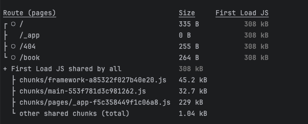
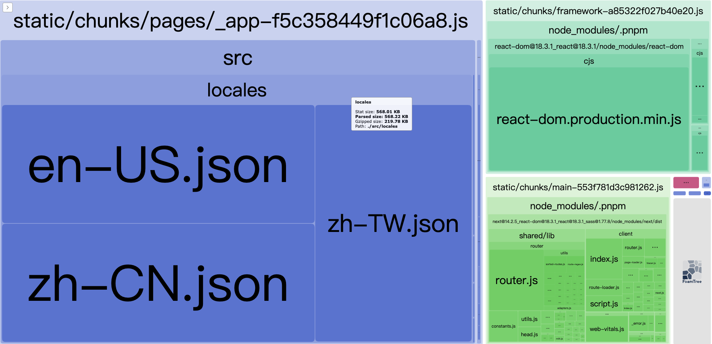
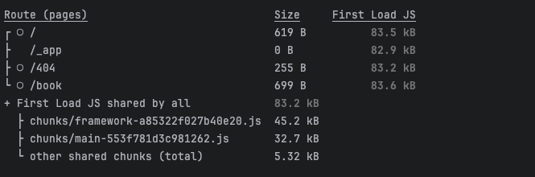
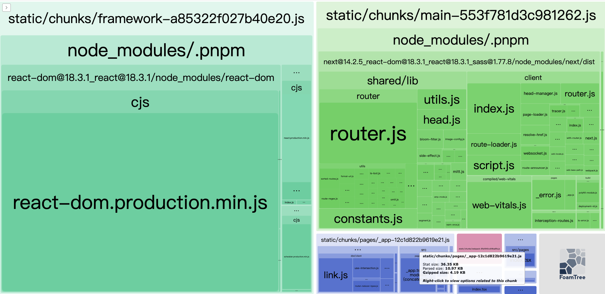

# i18n-optimize-loader-in-nextjs
## 背景
基于 next.js 实现多语言 key 的拆分

## 命令
```shell
# 
```


## 效果对比
> 未使用多语言 key 拆分策略
- 打包信息

- 可视化产物


> 使用多语言 key 拆分策略
- 打包信息

- 可视化产物


## 总结
> 优势
- 效果：将 key 拆分至 使用的组件中
- 优势
  - 按需加载多语言文件
  - 不会加载多余的 key
  - 使得缓存粒度更细
  - 对于已有的项目开发入侵小，开发基本无感知

> 缺点
- 当前基于 babel 实现的 loader 仅支持部分语法，可以稍微扩展下，但是也只应该支持部分语法，如果支持所有语法，则需要考虑所有场景，得不偿失